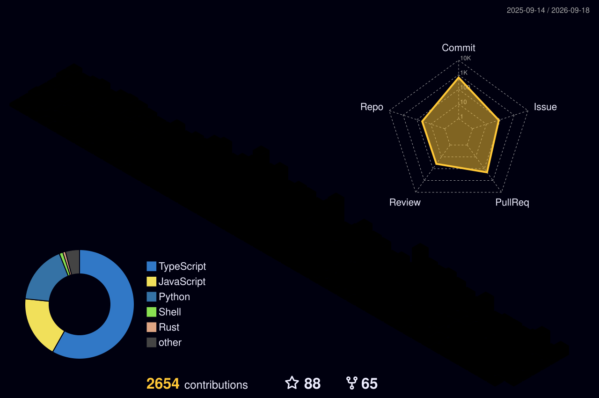

## AppSec & Web Developer

 

&nbsp;&nbsp;

 

<!-- CVE_REPORTED_START -->

<b>CVE Reported (1)</b>

 

| CVE | Score | Date | Description |
|:----|:------|:-----|:------------|
| [CVE-2026-32255](https://github.com/kanbn/kan/security/advisories/GHSA-qrx8-9hc6-jvqg) | 8.6 | 2026-03-19 | Kan is an open-source project management tool. In versions 0.5.4 and below, the /api/download/attatchment endpoint has no authentication and no URL validation. The Attachment Download endpoint accepts a user-supplied URL query parameter and passes it directly to fetch() server-side, and returns the full response body. An unauthenticated attacker can use this to make HTTP requests from the server to internal services, cloud metadata endpoints, or private network resources. This issue has been fixed in version 0.5.5. To workaround this issue, block or restrict access to /api/download/attatchment at the reverse proxy level (nginx, Cloudflare, etc.). |

<!-- CVE_REPORTED_END -->

<!-- POC_CVE_START -->

<b>CVE Proof of Concepts (3)</b>

 

| CVE | Description | ⭐ | 🍴 | 👁️ | 📥 |
|:----|:------------|---:|---:|----:|---:|
| [**CVE-2025-55182**](https://github.com/kOaDT/poc-cve-2025-55182) | This repository contains a POC of CVE-2025-55182, a critical (CVSS score 10.0) pre-authentication remote code execution vulnerability affecting React Server Components, also known as React2Shell. | 12 | 3 | 4546 | 1376 |
| [**CVE-2025-29927**](https://github.com/kOaDT/poc-cve-2025-29927) | This repository contains a POC and an exploit script for CVE-2025-29927, a critical vulnerability in Next.js that allows attackers to bypass authorization checks implemented in middleware. | 7 | 3 | 1762 | 537 |
| [**CVE-2026-32255**](https://github.com/kOaDT/poc-cve-2026-32255) | This repository contains a proof of concept (POC) for CVE-2026-32255, a high-severity Server-Side Request Forgery (SSRF) vulnerability in Kan, an open-source project management tool. | 2 | - | 887 | 230 |

<!-- POC_CVE_END -->

<!-- PROJECTS_START -->

<b>Projects (5)</b>

 

| Project | Description | ⭐ | 🍴 | 👁️ | 📥 |
|:--------|:------------|---:|---:|----:|---:|
| [**oss-oopssec-store**](https://github.com/kOaDT/oss-oopssec-store) | Security training for the apps you actually ship. Open your browser and start hacking. | 20 | 37 | 4480 | 50751 |
| [**cyber-bot**](https://github.com/kOaDT/cyber-bot) | Threat intelligence platform: RSS aggregation, NVD CVE tracking, ENISA EUVD, databreaches, ... | 5 | 1 | 240994 | 1253 |
| [**hate-crimes-map**](https://github.com/kOaDT/hate-crimes-map) | This project aims to visualize hate crime data to bring visibility to crimes that are often invisible or normalized by society. | 3 | - | 145 | 353 |
| [**crack-hash**](https://github.com/kOaDT/crack-hash) | A fast, multi-threaded hash cracking tool written in Rust. This tool performs dictionary attacks against hashed passwords. | 2 | - | 72 | 43 |
| [**awesome-pentest-tools**](https://github.com/kOaDT/awesome-pentest-tools) | Open-source offensive security tools, plus a vendor-agnostic AI agent that runs authorized pentest engagements using only tools from this list. | 2 | - | 9 | 135 |

<!-- PROJECTS_END -->

<!-- OSS_START -->

<b>OSS Contributions (16)</b>

 

| Repository | Description | ⭐ | 🍴 |
|:-----------|:------------|---:|---:|
| [**qazbnm456/awesome-web-security**](https://github.com/qazbnm456/awesome-web-security) | 🐶 A curated list of Web Security materials and resources. | 13435 | 1788 |
| [**kanbn/kan**](https://github.com/kanbn/kan) | The open source Trello alternative. | 4936 | 369 |
| [**beelzebub-labs/beelzebub**](https://github.com/beelzebub-labs/beelzebub) | A secure low code deception runtime framework, leveraging AI for System Virtualization. | 2029 | 198 |
| [**OWASP/www-community**](https://github.com/OWASP/www-community) | OWASP Community Pages are a place where OWASP can accept community contributions for security-related content. | 1363 | 828 |
| [**OWASP/www-project-vulnerable-web-applications-directory**](https://github.com/OWASP/www-project-vulnerable-web-applications-directory) | The OWASP Vulnerable Web Applications Directory Project (VWAD) is a comprehensive and well maintained registry of all known vulnerable web applications currently available. | 86 | 46 |
| [**usebruno/bruno**](https://github.com/usebruno/bruno) | Opensource IDE For Exploring and Testing API's (lightweight alternative to Postman/Insomnia) | 44629 | 2534 |
| [**infoslack/awesome-web-hacking**](https://github.com/infoslack/awesome-web-hacking) | A list of web application security | 6849 | 1285 |
| [**husnainfareed/awesome-ethical-hacking-resources**](https://github.com/husnainfareed/awesome-ethical-hacking-resources) | 😎 🔗 Awesome list about all kinds of resources for learning Ethical Hacking and Penetration Testing. | 3499 | 540 |
| [**lingdojo/kana-dojo**](https://github.com/lingdojo/kana-dojo) | Aesthetic, minimalist platform for learning Japanese inspired by Duolingo and Monkeytype, built with Next.js and sponsored by Vercel. Beginner-friendly with plenty of good first issues - all contributions are welcome! | 2538 | 2161 |
| [**fabionoth/awesome-cyber-security**](https://github.com/fabionoth/awesome-cyber-security) | A collection of awesome software, libraries, documents, books, resources and cools stuffs about security. | 1882 | 256 |
| [**vavkamil/awesome-vulnerable-apps**](https://github.com/vavkamil/awesome-vulnerable-apps) | Awesome Vulnerable Applications | 1413 | 216 |
| [**kaiiyer/awesome-vulnerable**](https://github.com/kaiiyer/awesome-vulnerable) | A curated list of VULNERABLE APPS and SYSTEMS which can be used as PENETRATION TESTING PRACTICE LAB. | 1321 | 217 |
| [**Grafikart/Grafikart.fr**](https://github.com/Grafikart/Grafikart.fr) | Dépôt pour la nouvelle version de Grafikart.fr | 686 | 186 |
| [**okhosting/awesome-cyber-security**](https://github.com/okhosting/awesome-cyber-security) | A curated list of cyber security resources and tools. | 543 | 78 |
| [**noraj/rawsec-cybersecurity-inventory**](https://github.com/noraj/rawsec-cybersecurity-inventory) | An inventory of tools and resources about CyberSecurity that  aims to help people to find everything related to CyberSecurity. | 338 | 72 |
| [**secnotes/awesome-cybersecurity**](https://github.com/secnotes/awesome-cybersecurity) | A collection of awesome github repositories about security | 73 | 7 |

<!-- OSS_END -->

<!-- PUBLICATIONS_START -->

<b>Publications (1)</b>

 

| Title | Platform | Category | Date |
|:------|:---------|:---------|:-----|
| [MCP Tool Poisoning](https://owasp.org/www-community/attacks/MCP_Tool_Poisoning) | OWASP | article | 2026-03-26 |

<!-- PUBLICATIONS_END -->

<b>Github Metrics</b>

 

</img>

<!-- THM_STATS_START -->

<b>TryHackMe Stats</b>

 

| Global Rank | Top | Streak |
|-------------|-----|--------|
| #13759 | 1% | 658 days |

<!-- THM_STATS_END -->

<!-- THM_BADGES_START -->

<b>TryHackMe Badges (49)</b>

 

-  **Networking Nerd** — _Completing the 'Network Fundamentals' module_
-  **7 Day Streak** — _Achieving a 7 day hacking streak_
-  **Webbed** — _Understands how the world wide web works_
-  **World Wide Web** — _Completing the 'How The Web Works' module_
-  **cat linux.txt** — _Being competent in Linux_
-  **30 Day Streak** — _Hacking for 30 days solid_
-  **OWASP Top 10** — _Understanding every OWASP vulnerability_
-  **Hash Cracker** — _Cracking all those hashes_
-  **Metasploitable** — _Contains the knowledge to use Metasploit_
-  **Blue** — _Hacking into Windows via EternalBlue_
-  **Cyber Ready** — _Understanding impact of training on teams_
-  **Sword Apprentice** — _Completing the SQLMap room_
-  **Shield Apprentice** — _Completing the FlareVM room_
-  **90 Day Streak** — _Hacking for 90 days in a row_
-  **Linux PrivEsc** — _Mastering Linux Privilege Escalation_
-  **Pentesting Principles** — _Completing the 'Introduction to Pentesting' module_
-  **Intro to Web Hacking** — _Completing the 'Introduction to Web Hacking' module_
-  **Advent of Cyber 2024** — _Completing Advent of Cyber 2024!_
-  **Burp'ed** — _Completing the Burp Suite module_
-  **180 Day Streak** — _Hacking for 180 days in a row_
-  **Authentication Striker** — _Used the Hammer to bypass authentication_
-  **SQL Slayer** — _Conquered Advanced SQL Injection_
-  **System Sniffer** — _Completed the File Path traversal room_
-  **OhSINT** — _Completing the OhSINT room_
-  **Client-Side Champ** — _Successfully exploited client-side vulnerabilities_
-  **Introduction to Security Engineering** — _Completed the Security Engineer Intro room!_
-  **Calculated Risk** — _Completed the Risk Management room! _
-  **3 Day Streak** — _Achieving a 3 day hacking streak_
-  **Network and System Security** — _Finished the Auditing and Monitoring room!_
-  **Software Security** — _Completed the OWASP API Security Top 10 rooms! _
-  **365 Day Streak** — _Hacking for 365 days in a row_
-  **The Course Awakens** — _Finishing the first room in the DevSecOps path!_
-  **Just have to deal with it** — _Successfully managed a cyber crisis! _
-  **Raffle Royalty** — _Participating in Hack2Win 2025!_
-  **/opt/m0th3r** — _Finishing Mother’s Secret!_
-  **Skilled Navigator** — _Finishing the Eviction challenge!_
-  **First Step into SOC** — _Explored emerging threats and SOC response_
-  **SOC Apprentice** — _Explored how a SOC team operates from inside_
-  **First alert closed** — _Closing your first alert_
-  **First scenario completed** — _Completing your first scenario_
-  **100% true positive rate** — _Achieving 100% true positive rate in a scenario_
-  **500 Day Streak** — _Hacking for 500 days in a row_
-  **Tooling Specialist** — _Adept in creating custom offensive tooling_
-  **Advent of Cyber 2025** — _Completing Advent of Cyber 2025!_
-  **Model Compromise** — _Completed the LLM Attacks Module_
-  **Session Held** — _Completing 4 weekly missions in a row!_
-  **Security Awareness** — _Completing the cyber security awareness module_
-  **Adversarial Defence Ops** — _Trained to Defend, Built to Learn._
-  **AI Odyssey** — _Taking part in the AI Odyssey event!_

<!-- THM_BADGES_END -->

<!-- THM_ROOMS_START -->

<b>TryHackMe Completed Rooms (329)</b>

 

| # | Room | Difficulty |
|---|------|------------|
| 1 | [Crack the hash](https://tryhackme.com/room/crackthehash) | easy |
| 2 | [Kali Machine](https://tryhackme.com/room/kali) | easy |
| 3 | [Pickle Rick](https://tryhackme.com/room/picklerick) | easy |
| 4 | [Blue](https://tryhackme.com/room/blue) | easy |
| 5 | [OhSINT](https://tryhackme.com/room/ohsint) | easy |
| 6 | [Basic Pentesting](https://tryhackme.com/room/basicpentestingjt) | easy |
| 7 | [Vulnversity](https://tryhackme.com/room/vulnversity) | easy |
| 8 | [Simple CTF](https://tryhackme.com/room/easyctf) | easy |
| 9 | [Kenobi](https://tryhackme.com/room/kenobi) | easy |
| 10 | [tmux](https://tryhackme.com/room/rptmux) | easy |
| 11 | [Steel Mountain](https://tryhackme.com/room/steelmountain) | easy |
| 12 | [Hacking with PowerShell](https://tryhackme.com/room/powershell) | easy |
| 13 | [Bebop](https://tryhackme.com/room/bebop) | easy |
| 14 | [DVWA](https://tryhackme.com/room/dvwa) | easy |
| 15 | [Agent Sudo](https://tryhackme.com/room/agentsudoctf) | easy |
| 16 | [LazyAdmin](https://tryhackme.com/room/lazyadmin) | easy |
| 17 | [Geolocating Images](https://tryhackme.com/room/geolocatingimages) | easy |
| 18 | [Sudo Security Bypass](https://tryhackme.com/room/sudovulnsbypass) | info |
| 19 | [Introductory Networking](https://tryhackme.com/room/introtonetworking) | easy |
| 20 | [Common Linux Privesc](https://tryhackme.com/room/commonlinuxprivesc) | easy |
| 21 | [Google Dorking](https://tryhackme.com/room/googledorking) | easy |
| 22 | [Network Services](https://tryhackme.com/room/networkservices) | easy |
| 23 | [Introductory Researching](https://tryhackme.com/room/introtoresearch) | easy |
| 24 | [What the Shell?](https://tryhackme.com/room/introtoshells) | easy |
| 25 | [Hashing - Crypto 101](https://tryhackme.com/room/hashingcrypto101) | medium |
| 26 | [Linux PrivEsc](https://tryhackme.com/room/linuxprivesc) | medium |
| 27 | [Upload Vulnerabilities](https://tryhackme.com/room/uploadvulns) | easy |
| 28 | [Encryption - Crypto 101](https://tryhackme.com/room/encryptioncrypto101) | medium |
| 29 | [Bounty Hacker](https://tryhackme.com/room/cowboyhacker) | easy |
| 30 | [OWASP Juice Shop](https://tryhackme.com/room/owaspjuiceshop) | easy |
| 31 | [NIS - Linux Part I](https://tryhackme.com/room/nislinuxone) | easy |
| 32 | [Overpass](https://tryhackme.com/room/overpass) | easy |
| 33 | [Network Services 2](https://tryhackme.com/room/networkservices2) | easy |
| 34 | [Python Basics](https://tryhackme.com/room/pythonbasics) | easy |
| 35 | [RootMe](https://tryhackme.com/room/rrootme) | easy |
| 36 | [Physical Security Intro](https://tryhackme.com/room/physicalsecurityintro) | easy |
| 37 | [The Hacker Methodology](https://tryhackme.com/room/hackermethodology) | easy |
| 38 | [Tutorial](https://tryhackme.com/room/tutorial) | easy |
| 39 | [Getting Started](https://tryhackme.com/room/gettingstarted) | easy |
| 40 | [MITRE](https://tryhackme.com/room/mitre) | medium |
| 41 | [Starting Out In Cyber Sec](https://tryhackme.com/room/startingoutincybersec) | easy |
| 42 | [Nmap](https://tryhackme.com/room/furthernmap) | easy |
| 43 | [Introduction to Flask](https://tryhackme.com/room/flask) | easy |
| 44 | [John the Ripper: The Basics](https://tryhackme.com/room/johntheripperbasics) | easy |
| 45 | [Cryptography for Dummies](https://tryhackme.com/room/cryptographyfordummies) | easy |
| 46 | [How to use TryHackMe](https://tryhackme.com/room/howtousetryhackme) | easy |
| 47 | [Linux Fundamentals Part 1](https://tryhackme.com/room/linuxfundamentalspart1) | info |
| 48 | [Linux Fundamentals Part 2](https://tryhackme.com/room/linuxfundamentalspart2) | info |
| 49 | [How Websites Work](https://tryhackme.com/room/howwebsiteswork) | easy |
| 50 | [Linux Fundamentals Part 3](https://tryhackme.com/room/linuxfundamentalspart3) | info |
| 51 | [Putting it all together](https://tryhackme.com/room/puttingitalltogether) | easy |
| 52 | [DNS in Detail](https://tryhackme.com/room/dnsindetail) | easy |
| 53 | [HTTP in Detail](https://tryhackme.com/room/httpindetail) | easy |
| 54 | [Windows Fundamentals 1](https://tryhackme.com/room/windowsfundamentals1xbx) | info |
| 55 | [Windows Fundamentals 2](https://tryhackme.com/room/windowsfundamentals2x0x) | info |
| 56 | [Learn and win prizes](https://tryhackme.com/room/tickets1) | info |
| 57 | [SQLMAP](https://tryhackme.com/room/sqlmap) | easy |
| 58 | [What is Networking?](https://tryhackme.com/room/whatisnetworking) | info |
| 59 | [Intro to LAN](https://tryhackme.com/room/introtolan) | info |
| 60 | [OSI Model](https://tryhackme.com/room/osimodelzi) | info |
| 61 | [Packets & Frames](https://tryhackme.com/room/packetsframes) | info |
| 62 | [Extending Your Network](https://tryhackme.com/room/extendingyournetwork) | info |
| 63 | [Learning Cyber Security](https://tryhackme.com/room/beginnerpathintro) | easy |
| 64 | [Windows Fundamentals 3](https://tryhackme.com/room/windowsfundamentals3xzx) | info |
| 65 | [Linux Privilege Escalation](https://tryhackme.com/room/linprivesc) | medium |
| 66 | [Walking An Application](https://tryhackme.com/room/walkinganapplication) | easy |
| 67 | [Pentesting Fundamentals](https://tryhackme.com/room/pentestingfundamentals) | easy |
| 68 | [Principles of Security](https://tryhackme.com/room/principlesofsecurity) | info |
| 69 | [Metasploit: Exploitation](https://tryhackme.com/room/metasploitexploitation) | easy |
| 70 | [Content Discovery](https://tryhackme.com/room/contentdiscovery) | easy |
| 71 | [Subdomain Enumeration](https://tryhackme.com/room/subdomainenumeration) | easy |
| 72 | [Authentication Bypass](https://tryhackme.com/room/authenticationbypass) | easy |
| 73 | [Junior Security Analyst Intro](https://tryhackme.com/room/jrsecanalystintrouxo) | easy |
| 74 | [Passive Reconnaissance](https://tryhackme.com/room/passiverecon) | easy |
| 75 | [Active Reconnaissance](https://tryhackme.com/room/activerecon) | easy |
| 76 | [Nmap Live Host Discovery](https://tryhackme.com/room/nmap01) | medium |
| 77 | [Nmap Basic Port Scans](https://tryhackme.com/room/nmap02) | easy |
| 78 | [Nmap Advanced Port Scans](https://tryhackme.com/room/nmap03) | medium |
| 79 | [Metasploit: Introduction ](https://tryhackme.com/room/metasploitintro) | easy |
| 80 | [IDOR](https://tryhackme.com/room/idor) | easy |
| 81 | [Vulnerabilities 101](https://tryhackme.com/room/vulnerabilities101) | easy |
| 82 | [Metasploit: Meterpreter](https://tryhackme.com/room/meterpreter) | easy |
| 83 | [Intro to SSRF](https://tryhackme.com/room/ssrfqi) | easy |
| 84 | [Pyramid Of Pain ](https://tryhackme.com/room/pyramidofpainax) | easy |
| 85 | [Intro to Cross-site Scripting](https://tryhackme.com/room/xss) | easy |
| 86 | [Nmap Post Port Scans](https://tryhackme.com/room/nmap04) | medium |
| 87 | [Cyber Kill Chain ](https://tryhackme.com/room/cyberkillchainzmt) | easy |
| 88 | [Diamond Model](https://tryhackme.com/room/diamondmodelrmuwwg42) | easy |
| 89 | [Security Awareness](https://tryhackme.com/room/securityawarenessintro) | info |
| 90 | [Vulnerability Capstone](https://tryhackme.com/room/vulnerabilitycapstone) | easy |
| 91 | [Exploit Vulnerabilities](https://tryhackme.com/room/exploitingavulnerabilityv2) | easy |
| 92 | [Protocols and Servers](https://tryhackme.com/room/protocolsandservers) | easy |
| 93 | [SQL Injection](https://tryhackme.com/room/sqlinjectionlm) | medium |
| 94 | [Command Injection](https://tryhackme.com/room/oscommandinjection) | easy |
| 95 | [Net Sec Challenge](https://tryhackme.com/room/netsecchallenge) | easy |
| 96 | [File Inclusion](https://tryhackme.com/room/fileinc) | medium |
| 97 | [Protocols and Servers 2](https://tryhackme.com/room/protocolsandservers2) | medium |
| 98 | [Common Attacks](https://tryhackme.com/room/commonattacks) | easy |
| 99 | [Red Team Fundamentals](https://tryhackme.com/room/redteamfundamentals) | easy |
| 100 | [Pwnkit: CVE-2021-4034](https://tryhackme.com/room/pwnkit) | info |
| 101 | [Threat Intelligence Tools](https://tryhackme.com/room/threatinteltools) | easy |
| 102 | [Intro to Digital Forensics](https://tryhackme.com/room/introdigitalforensics) | easy |
| 103 | [Introduction to DevSecOps](https://tryhackme.com/room/introductiontodevsecops) | medium |
| 104 | [Operating System Security](https://tryhackme.com/room/operatingsystemsecurity) | easy |
| 105 | [Offensive Security Intro](https://tryhackme.com/room/offensivesecurityintro) | easy |
| 106 | [Lo-Fi](https://tryhackme.com/room/lofi) | easy |
| 107 | [Network Security](https://tryhackme.com/room/intronetworksecurity) | easy |
| 108 | [Web Application Security](https://tryhackme.com/room/introwebapplicationsecurity) | easy |
| 109 | [Unified Kill Chain](https://tryhackme.com/room/unifiedkillchain) | easy |
| 110 | [Spring4Shell: CVE-2022-22965](https://tryhackme.com/room/spring4shell) | info |
| 111 | [Defensive Security Intro](https://tryhackme.com/room/defensivesecurityintro) | easy |
| 112 | [SSDLC](https://tryhackme.com/room/securesdlc) | medium |
| 113 | [Security Operations](https://tryhackme.com/room/securityoperations) | easy |
| 114 | [Careers in Cyber](https://tryhackme.com/room/careersincyber) | info |
| 115 | [Windows Privilege Escalation](https://tryhackme.com/room/windowsprivesc20) | medium |
| 116 | [Wireshark: The Basics](https://tryhackme.com/room/wiresharkthebasics) | easy |
| 117 | [Intro to Cyber Threat Intel](https://tryhackme.com/room/cyberthreatintel) | easy |
| 118 | [Introduction to SIEM](https://tryhackme.com/room/introtosiem) | easy |
| 119 | [Intro to Containerisation](https://tryhackme.com/room/introtocontainerisation) | easy |
| 120 | [Active Directory Basics](https://tryhackme.com/room/winadbasics) | easy |
| 121 | [Microsoft Windows Hardening](https://tryhackme.com/room/microsoftwindowshardening) | easy |
| 122 | [Security Principles](https://tryhackme.com/room/securityprinciples) | easy |
| 123 | [Atlassian CVE-2022-26134](https://tryhackme.com/room/cve202226134) | easy |
| 124 | [Secure Network Architecture](https://tryhackme.com/room/introtosecurityarchitecture) | medium |
| 125 | [Active Directory Hardening](https://tryhackme.com/room/activedirectoryhardening) | medium |
| 126 | [Introduction to Cryptography](https://tryhackme.com/room/cryptographyintro) | medium |
| 127 | [Network Security Protocols](https://tryhackme.com/room/networksecurityprotocols) | medium |
| 128 | [OWASP API Security Top 10 - 2](https://tryhackme.com/room/owaspapisecuritytop10d0) | medium |
| 129 | [OWASP API Security Top 10 - 1](https://tryhackme.com/room/owaspapisecuritytop105w) | medium |
| 130 | [Intro to Cloud Security](https://tryhackme.com/room/introductiontocloudsecurityc6) | easy |
| 131 | [Linux System Hardening](https://tryhackme.com/room/linuxsystemhardening) | medium |
| 132 | [Virtualization and Containers](https://tryhackme.com/room/virtualizationandcontainers) | easy |
| 133 | [Vulnerability Management](https://tryhackme.com/room/vulnerabilitymanagementkj) | medium |
| 134 | [DAST](https://tryhackme.com/room/dastzap) | medium |
| 135 | [Weaponizing Vulnerabilities](https://tryhackme.com/room/weaponizingvulnerabilities) | medium |
| 136 | [Identity and Access Management](https://tryhackme.com/room/iaaaidm) | easy |
| 137 | [Network Device Hardening](https://tryhackme.com/room/networkdevicehardening) | medium |
| 138 | [Threat Modelling](https://tryhackme.com/room/threatmodelling) | medium |
| 139 | [Governance & Regulation](https://tryhackme.com/room/cybergovernanceregulation) | easy |
| 140 | [Mother's Secret](https://tryhackme.com/room/codeanalysis) | easy |
| 141 | [Security Engineer Intro](https://tryhackme.com/room/securityengineerintro) | easy |
| 142 | [SAST](https://tryhackme.com/room/sast) | medium |
| 143 | [Risk Management](https://tryhackme.com/room/seriskmanagement) | easy |
| 144 | [Broken Access Control](https://tryhackme.com/room/owaspbrokenaccesscontrol) | easy |
| 145 | [Logging for Accountability](https://tryhackme.com/room/loggingforaccountability) | easy |
| 146 | [Traverse](https://tryhackme.com/room/traverse) | easy |
| 147 | [Auditing and Monitoring](https://tryhackme.com/room/auditingandmonitoringse) | easy |
| 148 | [Intro to IR and IM](https://tryhackme.com/room/introtoirandim) | easy |
| 149 | [Becoming a First Responder](https://tryhackme.com/room/becomingafirstresponder) | info |
| 150 | [Cyber Crisis Management](https://tryhackme.com/room/cybercrisismanagement) | easy |
| 151 | [W1seGuy](https://tryhackme.com/room/w1seguy) | easy |
| 152 | [Burp Suite: The Basics](https://tryhackme.com/room/burpsuitebasics) | info |
| 153 | [Burp Suite: Repeater](https://tryhackme.com/room/burpsuiterepeater) | info |
| 154 | [Burp Suite: Intruder](https://tryhackme.com/room/burpsuiteintruder) | medium |
| 155 | [Burp Suite: Other Modules](https://tryhackme.com/room/burpsuiteom) | easy |
| 156 | [Burp Suite: Extensions](https://tryhackme.com/room/burpsuiteextensions) | easy |
| 157 | [Eviction](https://tryhackme.com/room/eviction) | easy |
| 158 | [Summit](https://tryhackme.com/room/summit) | easy |
| 159 | [Light](https://tryhackme.com/room/lightroom) | easy |
| 160 | [HTTP Request Smuggling](https://tryhackme.com/room/httprequestsmuggling) | easy |
| 161 | [The Witch's Cauldron](https://tryhackme.com/room/cauldron) | easy |
| 162 | [Confluence CVE-2023-22515](https://tryhackme.com/room/confluence202322515) | easy |
| 163 | [SSRF](https://tryhackme.com/room/ssrfhr) | medium |
| 164 | [Become a Hacker](https://tryhackme.com/room/becomeahackeroa) | easy |
| 165 | [The Sticker Shop](https://tryhackme.com/room/thestickershop) | easy |
| 166 | [File Inclusion, Path Traversal](https://tryhackme.com/room/filepathtraversal) | medium |
| 167 | [CSRF](https://tryhackme.com/room/csrfV2) | medium |
| 168 | [XSS](https://tryhackme.com/room/axss) | easy |
| 169 | [CORS & SOP](https://tryhackme.com/room/corsandsop) | easy |
| 170 | [Prototype Pollution](https://tryhackme.com/room/prototypepollution) | medium |
| 171 | [Snyk Open Source](https://tryhackme.com/room/snykopensource) | easy |
| 172 | [Include](https://tryhackme.com/room/include) | medium |
| 173 | [Moniker Link (CVE-2024-21413)](https://tryhackme.com/room/monikerlink) | easy |
| 174 | [Snyk Code](https://tryhackme.com/room/snykcode) | easy |
| 175 | [Race Conditions](https://tryhackme.com/room/raceconditionsattacks) | medium |
| 176 | [LDAP Injection](https://tryhackme.com/room/ldapinjection) | easy |
| 177 | [Whats Your Name?](https://tryhackme.com/room/whatsyourname) | medium |
| 178 | [DOM-Based Attacks](https://tryhackme.com/room/dombasedattacks) | easy |
| 179 | [XXE Injection](https://tryhackme.com/room/xxeinjection) | medium |
| 180 | [Insecure Deserialisation](https://tryhackme.com/room/insecuredeserialisation) | medium |
| 181 | [Windows Command Line](https://tryhackme.com/room/windowscommandline) | easy |
| 182 | [Search Skills](https://tryhackme.com/room/searchskills) | easy |
| 183 | [Server-side Template Injection](https://tryhackme.com/room/serversidetemplateinjection) | medium |
| 184 | [JWT Security](https://tryhackme.com/room/jwtsecurity) | easy |
| 185 | [Nmap: The Basics](https://tryhackme.com/room/nmap) | easy |
| 186 | [Networking Concepts](https://tryhackme.com/room/networkingconcepts) | easy |
| 187 | [Tcpdump: The Basics](https://tryhackme.com/room/tcpdump) | easy |
| 188 | [Networking Essentials](https://tryhackme.com/room/networkingessentials) | easy |
| 189 | [Networking Core Protocols](https://tryhackme.com/room/networkingcoreprotocols) | easy |
| 190 | [Networking Secure Protocols](https://tryhackme.com/room/networkingsecureprotocols) | easy |
| 191 | [Advanced SQL Injection](https://tryhackme.com/room/advancedsqlinjection) | medium |
| 192 | [Incident Response Fundamentals](https://tryhackme.com/room/incidentresponsefundamentals) | easy |
| 193 | [ORM Injection](https://tryhackme.com/room/orminjection) | medium |
| 194 | [NoSQL Injection](https://tryhackme.com/room/nosqlinjectiontutorial) | easy |
| 195 | [Logs Fundamentals](https://tryhackme.com/room/logsfundamentals) | easy |
| 196 | [Enumeration & Brute Force](https://tryhackme.com/room/enumerationbruteforce) | easy |
| 197 | [SOC Fundamentals](https://tryhackme.com/room/socfundamentals) | easy |
| 198 | [Digital Forensics Fundamentals](https://tryhackme.com/room/digitalforensicsfundamentals) | easy |
| 199 | [Session Management](https://tryhackme.com/room/sessionmanagement) | easy |
| 200 | [Injectics](https://tryhackme.com/room/injectics) | medium |
| 201 | [Firewall Fundamentals](https://tryhackme.com/room/firewallfundamentals) | easy |
| 202 | [OAuth Vulnerabilities](https://tryhackme.com/room/oauthvulnerabilities) | medium |
| 203 | [IDS Fundamentals](https://tryhackme.com/room/idsfundamentals) | easy |
| 204 | [Multi-Factor Authentication](https://tryhackme.com/room/multifactorauthentications) | easy |
| 205 | [Vulnerability Scanner Overview](https://tryhackme.com/room/vulnerabilityscanneroverview) | easy |
| 206 | [Hammer](https://tryhackme.com/room/hammer) | medium |
| 207 | [CyberChef: The Basics](https://tryhackme.com/room/cyberchefbasics) | easy |
| 208 | [Public Key Cryptography Basics](https://tryhackme.com/room/publickeycrypto) | easy |
| 209 | [Cryptography Basics](https://tryhackme.com/room/cryptographybasics) | easy |
| 210 | [Hashing Basics](https://tryhackme.com/room/hashingbasics) | easy |
| 211 | [CAPA: The Basics](https://tryhackme.com/room/capabasics) | easy |
| 212 | [Windows PowerShell](https://tryhackme.com/room/windowspowershell) | easy |
| 213 | [FlareVM: Arsenal of Tools](https://tryhackme.com/room/flarevmarsenaloftools) | easy |
| 214 | [REMnux: Getting Started](https://tryhackme.com/room/remnuxgettingstarted) | easy |
| 215 | [Linux Shells](https://tryhackme.com/room/linuxshells) | easy |
| 216 | [Length Extension Attacks](https://tryhackme.com/room/lengthextensionattacks) | medium |
| 217 | [Insecure Randomness](https://tryhackme.com/room/insecurerandomness) | easy |
| 218 | [Gobuster: The Basics](https://tryhackme.com/room/gobusterthebasics) | easy |
| 219 | [Training Impact on Teams](https://tryhackme.com/room/training) | info |
| 220 | [SQLMap: The Basics](https://tryhackme.com/room/sqlmapthebasics) | easy |
| 221 | [Advent of Cyber 2024](https://tryhackme.com/room/adventofcyber2024) | easy |
| 222 | [JavaScript Essentials](https://tryhackme.com/room/javascriptessentials) | easy |
| 223 | [Web Application Basics](https://tryhackme.com/room/webapplicationbasics) | easy |
| 224 | [SQL Fundamentals](https://tryhackme.com/room/sqlfundamentals) | easy |
| 225 | [Shells Overview](https://tryhackme.com/room/shellsoverview) | easy |
| 226 | [Padding Oracles](https://tryhackme.com/room/paddingoracles) | medium |
| 227 | [Breaking Crypto the Simple Way](https://tryhackme.com/room/breakingcryptothesimpleway) | easy |
| 228 | [Phishing Basics](https://tryhackme.com/room/phishingbasics) | easy |
| 229 | [Custom Tooling Using Python](https://tryhackme.com/room/customtoolingpython) | easy |
| 230 | [Custom Tooling using Burp](https://tryhackme.com/room/customtoolingviaburp) | hard |
| 231 | [Tooling via Browser Automation](https://tryhackme.com/room/customtoolingviabrowserautomation) | easy |
| 232 | [SOC L1 Alert Triage](https://tryhackme.com/room/socl1alerttriage) | easy |
| 233 | [SOC L1 Alert Reporting](https://tryhackme.com/room/socl1alertreporting) | easy |
| 234 | [SOC Workbooks and Lookups](https://tryhackme.com/room/socworkbookslookups) | easy |
| 235 | [Attacking ECB Oracles](https://tryhackme.com/room/attackingecboracles) | hard |
| 236 | [Next.js: CVE-2025-29927](https://tryhackme.com/room/nextjscve202529927) | easy |
| 237 | [SOC Metrics and Objectives](https://tryhackme.com/room/socmetricsobjectives) | easy |
| 238 | [AI/ML Security Threats](https://tryhackme.com/room/aimlsecuritythreats) | easy |
| 239 | [CAPTCHApocalypse](https://tryhackme.com/room/captchapocalypse) | medium |
| 240 | [Offensive Security Intro](https://tryhackme.com/room/offensivesecurityintrokK) | easy |
| 241 | [Erlang/OTP SSH: CVE-2025-32433](https://tryhackme.com/room/erlangotpsshcve202532433) | easy |
| 242 | [Writing Pentest Reports](https://tryhackme.com/room/writingpentestreports) | easy |
| 243 | [AI Forensics](https://tryhackme.com/room/aiforensics) | medium |
| 244 | [Extract](https://tryhackme.com/room/extract) | hard |
| 245 | [Cipher's Secret Message](https://tryhackme.com/room/hfb1cipherssecretmessage) | easy |
| 246 | [Evil-GPT](https://tryhackme.com/room/hfb1evilgpt) | easy |
| 247 | [Evil-GPT v2](https://tryhackme.com/room/hfb1evilgptv2) | easy |
| 248 | [Sequence](https://tryhackme.com/room/sequence) | medium |
| 249 | [Roundcube: CVE-2025-49113](https://tryhackme.com/room/roundcubecve202549113) | easy |
| 250 | [ContAInment](https://tryhackme.com/room/containment) | medium |
| 251 | [Chaining Vulnerabilities](https://tryhackme.com/room/chainingvulnerabilitiesZp) | easy |
| 252 | [Voyage](https://tryhackme.com/room/voyage) | medium |
| 253 | [Humans as Attack Vectors](https://tryhackme.com/room/humansattackvectors) | easy |
| 254 | [Systems as Attack Vectors](https://tryhackme.com/room/systemsattackvectors) | easy |
| 255 | [SOC Role in Blue Team](https://tryhackme.com/room/socroleinblueteam) | easy |
| 256 | [Web Security Essentials](https://tryhackme.com/room/websecurityessentials) | easy |
| 257 | [Defensive Security Intro](https://tryhackme.com/room/defensivesecurityintroQR) | easy |
| 258 | [Hack2Win: How you can grab extra tickets](https://tryhackme.com/room/hack2win) | info |
| 259 | [Introduction to EDR](https://tryhackme.com/room/introductiontoedrs) | easy |
| 260 | [Input Manipulation & Prompt Injection](https://tryhackme.com/room/inputmanipulationpromptinjection) | easy |
| 261 | [Data Integrity & Model Poisoning](https://tryhackme.com/room/modelpoisoning) | medium |
| 262 | [LLM Output Handling and Privacy Risks](https://tryhackme.com/room/outputhandlingandprivacyrisks) | easy |
| 263 | [IDOR - Santa’s Little IDOR](https://tryhackme.com/room/idor-aoc2025-zl6MywQid9) | medium |
| 264 | [Obfuscation - The Egg Shell File](https://tryhackme.com/room/obfuscation-aoc2025-e5r8t2y6u9) | medium |
| 265 | [XSS - Merry XSSMas](https://tryhackme.com/room/xss-aoc2025-c5j8b1m4t6) | easy |
| 266 | [Passwords - A Cracking Christmas](https://tryhackme.com/room/attacks-on-ecrypted-files-aoc2025-asdfghj123) | easy |
| 267 | [SOC Alert Triaging - Tinsel Triage](https://tryhackme.com/room/azuresentinel-aoc2025-a7d3h9k0p2) | medium |
| 268 | [Splunk Basics - Did you SIEM?](https://tryhackme.com/room/splunkforloganalysis-aoc2025-x8fj2k4rqp) | medium |
| 269 | [Phishing - Merry Clickmas](https://tryhackme.com/room/phishing-aoc2025-h2tkye9fzU) | easy |
| 270 | [Prompt Injection - Sched-yule conflict](https://tryhackme.com/room/promptinjection-aoc2025-sxUMnCkvLO) | easy |
| 271 | [Linux CLI - Shells Bells](https://tryhackme.com/room/linuxcli-aoc2025-o1fpqkvxti) | easy |
| 272 | [YARA Rules - YARA mean one!](https://tryhackme.com/room/yara-aoc2025-q9w1e3y5u7) | medium |
| 273 | [Forensics - Registry Furensics](https://tryhackme.com/room/registry-forensics-aoc2025-h6k9j2l5p8) | medium |
| 274 | [Exploitation with cURL - Hoperation Eggsploit](https://tryhackme.com/room/webhackingusingcurl-aoc2025-w8q1a4s7d0) | easy |
| 275 | [ICS/Modbus - Claus for Concern](https://tryhackme.com/room/ICS-modbus-aoc2025-g3m6n9b1v4) | medium |
| 276 | [Race Conditions - Toy to The World](https://tryhackme.com/room/race-conditions-aoc2025-d7f0g3h6j9) | easy |
| 277 | [Network Discovery - Scan-ta Clause](https://tryhackme.com/room/networkservices-aoc2025-jnsoqbxgky) | easy |
| 278 | [Containers - DoorDasher's Demise](https://tryhackme.com/room/container-security-aoc2025-z0x3v6n9m2) | medium |
| 279 | [CyberChef - Hoperation Save McSkidy](https://tryhackme.com/room/encoding-decoding-aoc2025-s1a4z7x0c3) | medium |
| 280 | [Phishing - Phishmas Greetings](https://tryhackme.com/room/spottingphishing-aoc2025-r2g4f6s8l0) | medium |
| 281 | [AI in Security - old sAInt nick](https://tryhackme.com/room/AIforcyber-aoc2025-y9wWQ1zRgB) | easy |
| 282 | [Malware Analysis - Malhare.exe](https://tryhackme.com/room/htapowershell-aoc2025-p2l5k8j1h4) | easy |
| 283 | [C2 Detection - Command & Carol](https://tryhackme.com/room/detecting-c2-with-rita-aoc2025-m9n2b5v8c1) | medium |
| 284 | [AWS Security - S3cret Santa](https://tryhackme.com/room/cloudenum-aoc2025-y4u7i0o3p6) | easy |
| 285 | [Malware Analysis - Egg-xecutable](https://tryhackme.com/room/malware-sandbox-aoc2025-SD1zn4fZQt) | medium |
| 286 | [Web Attack Forensics - Drone Alone](https://tryhackme.com/room/webattackforensics-aoc2025-b4t7c1d5f8) | medium |
| 287 | [Cloud Security Pitfalls](https://tryhackme.com/room/cloudsecuritypitfalls) | easy |
| 288 | [Juicy](https://tryhackme.com/room/juicy) | medium |
| 289 | [Advent of Cyber Prep Track](https://tryhackme.com/room/adventofcyberpreptrack) | easy |
| 290 | [OWASP Top 10 2025: Insecure Data Handling](https://tryhackme.com/room/owasptopten2025three) | easy |
| 291 | [Django: CVE-2025-64459](https://tryhackme.com/room/djangocve202564459) | easy |
| 292 | [BankGPT](https://tryhackme.com/room/bankgpt) | easy |
| 293 | [HealthGPT](https://tryhackme.com/room/healthgpt) | easy |
| 294 | [React2Shell: CVE-2025-55182](https://tryhackme.com/room/react2shellcve202555182) | easy |
| 295 | [Virtualisation Basics](https://tryhackme.com/room/virtualisationbasics) | easy |
| 296 | [Operating Systems: Introduction](https://tryhackme.com/room/operatingsystemsintroduction) | easy |
| 297 | [Linux CLI Basics](https://tryhackme.com/room/linuxclibasics) | easy |
| 298 | [Data Representation](https://tryhackme.com/room/datarepresentation) | easy |
| 299 | [Data Encoding](https://tryhackme.com/room/dataencoding) | easy |
| 300 | [JavaScript: Simple Demo](https://tryhackme.com/room/javascriptsimpledemo) | medium |
| 301 | [Python: Simple Demo](https://tryhackme.com/room/pythonsimpledemo) | easy |
| 302 | [LLM Security](https://tryhackme.com/room/llmsecurity) | medium |
| 303 | [Windows Basics](https://tryhackme.com/room/windowsbasics) | easy |
| 304 | [Cloud Computing Fundamentals](https://tryhackme.com/room/cloudcomputingfundamentals) | easy |
| 305 | [Windows CLI Basics](https://tryhackme.com/room/windowsclibasics) | easy |
| 306 | [The CIA Triad](https://tryhackme.com/room/theciatriad) | easy |
| 307 | [Database SQL Basics](https://tryhackme.com/room/databasesqlbasics) | easy |
| 308 | [Cryptography Concepts](https://tryhackme.com/room/cryptographyconcepts) | easy |
| 309 | [Client-Server Basics](https://tryhackme.com/room/clientserverbasics) | easy |
| 310 | [Become a Hacker](https://tryhackme.com/room/becomeahacker) | easy |
| 311 | [Become a Defender](https://tryhackme.com/room/becomeadefender) | easy |
| 312 | [n8n: CVE-2025-68613](https://tryhackme.com/room/n8ncve202568613) | easy |
| 313 | [Offensive Security Intro](https://tryhackme.com/room/offensivesecurityintrokKx12) | easy |
| 314 | [Inside a Computer System](https://tryhackme.com/room/insideacomputer) | easy |
| 315 | [GeoServer: CVE-2025-58360](https://tryhackme.com/room/geoservercve202558360) | medium |
| 316 | [Offensive Security Intro](https://tryhackme.com/room/offensivesecurityintrokKx12l39) | easy |
| 317 | [Defensive Security Intro](https://tryhackme.com/room/defensivesecurityintroez) | info |
| 318 | [Computer Types](https://tryhackme.com/room/computertypes) | easy |
| 319 | [Dive Into Pentesting](https://tryhackme.com/room/diveintopentesting) | easy |
| 320 | [Prompt Engineering](https://tryhackme.com/room/promptengineeringaisec) | easy |
| 321 | [AI Models & Data](https://tryhackme.com/room/aimodelsdata) | medium |
| 322 | [Defensive Security Intro](https://tryhackme.com/room/defensivesecurityintroezn39) | info |
| 323 | [AI Threat Modelling](https://tryhackme.com/room/aithreatmodelling) | medium |
| 324 | [Securing AI Systems](https://tryhackme.com/room/securingaisystems) | medium |
| 325 | [CSRF Introduction](https://tryhackme.com/room/csrfintroduction) | easy |
| 326 | [AI System Reconnaissance](https://tryhackme.com/room/aisystemreconnaissance) | medium |
| 327 | [Guided Pentest: Web](https://tryhackme.com/room/guidedpentestweb) | easy |
| 328 | [AI Threat Modelling Assessment](https://tryhackme.com/room/aithreatmodellingassessment) | easy |
| 329 | [AI Security Path Ticketing Event](https://tryhackme.com/room/aisecuritypathticketingevent) | info |

<!-- THM_ROOMS_END -->

<!-- CERTIFICATIONS_START -->

<!-- CERTIFICATIONS_END -->

<!-- CERTIFICATES_START -->

<b>Certificates (122)</b>

 

- [Carry out a web penetration test](https://drive.proton.me/urls/BMT4ZEJX14#rSOX6TfYnj0X) — _2026-05_
- [Introduction to DevSecOps: Culture and Methodology](https://drive.proton.me/urls/PBCKBPPDN8#yllbpawU9Opt) — _2026-05_
- [Dive Into the World of Cyber Incident Detection and Response](https://drive.proton.me/urls/378A1SPJJ8#b4zbL1v6NI9R) — _2026-04_
- [Protect your Connected Digital Systems by Following the 12 Best Practices from ANSSI](https://drive.proton.me/urls/CZHTZ2PED8#9D9nE6GODsxt) — _2026-04_
- [Analyze and Manage IT Risks](https://drive.proton.me/urls/3Y1HWYQCT4#Ca90ucSn6oSN) — _2026-03_
- [Everything You Need to Know About Computer Networks in Just a Few Hours](https://drive.proton.me/urls/75M9G2HE5C#aFM44IX0srti) — _2026-02_
- [Secure your Data with Cryptography](https://drive.proton.me/urls/QR4P3AC5C0#WLyO8wmdWwCY) — _2026-02_
- [Raise Cybersecurity Awareness Effectively](https://drive.proton.me/urls/NTFEGNBVQC#v7ra3gs9Q9a5) — _2026-02_
- [Secure your Network with VPNs and Firewalls](https://drive.proton.me/urls/63VBNKC09W#QCJOTohtakpE) — _2026-02_
- [Conduct Your Cybersecurity Monitoring](https://drive.proton.me/urls/65N4GRE4CG#jK50yBFNBAFt) — _2026-02_
- [Discover the Basics of Digital Security](https://drive.proton.me/urls/D74PR8VB28#2zKus9QYxHpi) — _2026-02_
- [Discover the World of Cybersecurity](https://drive.proton.me/urls/V8B8XBCNVC#OYriuFlC0ElJ) — _2026-02_
- [Try Hack Me - Advent of Cyber 2025](https://drive.proton.me/urls/VPWHGJQ4KM#o8NqajkQTTJq) — _2025-12_
- [Try Hack Me - Security Engineer](https://drive.proton.me/urls/3ESE629GDW#FTJnVotyfc73) — _2025-09_
- [Try Hack Me - Web Fundamentals](https://drive.proton.me/urls/6T65407KTC#jasSYPa2elWu) — _2025-02_
- [Try Hack Me - Jr Penetration Tester](https://drive.proton.me/urls/GHP7890C68#NZ01dYC23p0j) — _2025-01_
- [Try Hack Me - Advent of Cyber 2024](https://drive.proton.me/urls/05PHY6GF98#8U10SVDPoUBv) — _2024-12_
- [Try Hack Me - Complete Beginner](https://drive.proton.me/urls/TQTMQ4BC2C#MXk2ykWOiEIe) — _2024-11_
- [Try Hack Me - Cyber Security 101](https://drive.proton.me/urls/3NCEA2MSXG#LXwKl07QVNoS) — _2024-11_
- [Try Hack Me - Introduction to Cyber Security](https://drive.proton.me/urls/GWK39ADZ38#5opgmy4Ygy0a) — _2024-09_
- [Try Hack Me - Pre Security](https://drive.proton.me/urls/CJ3RNT023G#p4QFH6vNjI2f) — _2024-08_
- [Ethical Hacking: Social Engineering](https://drive.proton.me/urls/4NTFVHMJWW#FEKlPWvaYTUV) — _2024-08_
- [OWASP Top 10](https://drive.proton.me/urls/8034PTTCCG#AXeDTR0sQwoW) — _2023-11_
- [Security for Developers](https://drive.proton.me/urls/XGBWMGFJDR#ZW1vq64P54nu) — _2023-11_
- [Ethical Hacking: the Complete Course](https://drive.proton.me/urls/T6YXMQEPG0#mm1klyOBPKs9) — _2023-10_
- [Use ChatGPT to improve your productivity](https://drive.proton.me/urls/EDGMM47ECM#hd8bq3nwLksh) — _2023-05_
- [Ethereum and Solidity: The Complete Developer's Guide](https://drive.proton.me/urls/W692X2619G#9qBhhlTFYgFX) — _2023-03_
- [Discover the world of Information Systems](https://drive.proton.me/urls/Q0GWTENYVG#WLC7xA7prPDr) — _2022-09_
- [Get started with Linux](https://drive.proton.me/urls/Y3GMCFCH4G#xo1pqgkTcjEY) — _2022-07_
- [Simulate network architectures with GNS3](https://drive.proton.me/urls/QF35MV7B2C#9mEYvZz6BLOD) — _2022-05_
- [Design your TCP/IP network](https://drive.proton.me/urls/J87KPKSHCR#Dp5tUzVPT4Z1) — _2022-05_
- [Draw up a functional specification](https://drive.proton.me/urls/VHS4KMPE7M#s5Xo74bTvlNj) — _2022-04_
- [Design a clickable interface](https://drive.proton.me/urls/29Q55GW87W#0rMujRf4EIkQ) — _2022-04_
- [Set up your front-end environment](https://drive.proton.me/urls/0QQ43YDTCC#PPzRM1bcQ0vj) — _2022-04_
- [Discover the jobs of developer](https://drive.proton.me/urls/N2H2QNSRFR#s5xlXkDOlvLp) — _2022-04_
- [Develop your soft skills](https://drive.proton.me/urls/67VZHPX1G0#G4lGLTSeASgH) — _2022-04_
- [Use the Redux state manager to manage the state of your applications](https://drive.proton.me/urls/H5N0G0NKJ0#AlhYmWhkgvSW) — _2022-04_
- [Use design patterns in JavaScript](https://drive.proton.me/urls/F91KCBXH0C#6e0mzGlYQFlY) — _2022-04_
- [Learn how to use the command line in a terminal](https://drive.proton.me/urls/E8D6FNF1X8#SD54HjihF8wE) — _2022-04_
- [Manage code with Git and GitHub](https://drive.proton.me/urls/NHB8JZJ9B4#GDELJylOfo2T) — _2022-03_
- [Create a complete React application](https://drive.proton.me/urls/3HCQMT6XBW#wfJZNEDMRdKk) — _2022-03_
- [Get started with React](https://drive.proton.me/urls/EG8SGRFKK8#pM2zjJlWHYVX) — _2022-01_
- [Manage your time efficiently](https://drive.proton.me/urls/RYQEDRXCBM#bK81jFNcYiVx) — _2022-01_
- [Create responsive websites with Bootstrap 4](https://drive.proton.me/urls/ADE2Q3223W#pPoZOlK9JGcm) — _2021-12_
- [Create modern CSS animations](https://drive.proton.me/urls/QMFX53W5J4#q0oHOTOL2suY) — _2021-12_
- [Code an accessible website with HTML & CSS](https://drive.proton.me/urls/GAFDHZF22C#ksDujK0BCR7c) — _2021-11_
- [Test your Front End applications with JavaScript](https://drive.proton.me/urls/1AGYMEE6RR#ofiAasXImMNm) — _2021-11_
- [Debug your website interface](https://drive.proton.me/urls/AGAEZT25CC#2FzoAh6clK6B) — _2021-10_
- [Write the technical documentation for your project](https://drive.proton.me/urls/RN9SZVBF5G#5rzKEpfhAaFe) — _2021-10_
- [Test the interface of your site](https://drive.proton.me/urls/7NJX1GGVBM#h7WQQyp3WQeW) — _2021-10_
- [Create a web application with Vue.js](https://drive.proton.me/urls/CTF46QZW4C#vWShD8zzoh7U) — _2021-10_
- [Adopt REST APIs for your web projects](https://drive.proton.me/urls/6XNG2VG714#0AosFWoqjoGN) — _2021-09_
- [Go full stack with Node.js, Express and MongoDB](https://drive.proton.me/urls/DR2P4CDFWM#wnDrtjMPlfqa) — _2021-08_
- [Write JavaScript for the web](https://drive.proton.me/urls/WDQZHM91A4#3JN87iWCanvJ) — _2021-07_
- [Design accessible web content](https://drive.proton.me/urls/NTMVRF5HG0#NhOiPPVtBwyN) — _2021-07_
- [Learn to program with JavaScript](https://drive.proton.me/urls/TT9PVSQ8MM#ZIzgmHiwW9Wp) — _2021-07_
- [Simplify CSS with Sass](https://drive.proton.me/urls/F5XX9N7C64#oTFUmudHHmjM) — _2021-06_
- [Increase your traffic with natural referencing (SEO)](https://drive.proton.me/urls/RZYP01NHN4#G02unqkHYdn9) — _2021-06_
- [Optimize the referencing of your site (SEO) by improving its technical performance](https://drive.proton.me/urls/F1XR38GRBR#V177aFRaeXCZ) — _2021-06_
- [Secure your web applications with OWASP](https://drive.proton.me/urls/X6H3HKGMWW#uPjpoOlBuKJV) — _2021-05_
- [Learn to learn](https://drive.proton.me/urls/XZV693PPV0#cuUJU9aWYt14) — _2021-02_
- [The stages of the Mentor's life](https://drive.proton.me/urls/2DA4ZD0XM8#3gI8rqjJ5jHH) — _2021-02_
- [Learn about Python for data analysis](https://drive.proton.me/urls/PF5Q4429NM#FbgiL0RgCWlb) — _2020-04_
- [Ultra-fast applications with Node.js](https://drive.proton.me/urls/AK4KNYKT58#lkGhvEOsrCSw) — _2020-02_
- [Perfect your agile project management](https://drive.proton.me/urls/7ZB7KDC01W#c4PAlzcNcVWJ) — _2019-02_
- [Understanding Bitcoin and the Blockchain](https://drive.proton.me/urls/RFVZV873DM#faTOLO6eRsDv) — _2019-02_
- [Discover the cloud with Amazon Web Services](https://drive.proton.me/urls/K90YHHK0B4#auCKPIdbkoJs) — _2019-02_
- [Manage your project with a Scrum team](https://drive.proton.me/urls/ZEP4F0JTZM#JWwZGIDJ8t9d) — _2019-02_
- [Continue with Ruby on Rails](https://drive.proton.me/urls/P14X44CV3R#h9I58HSe6QGY) — _2019-01_
- [Set up an information monitoring system](https://drive.proton.me/urls/K328S3H9C0#T3NAuv07eexM) — _2019-01_
- [Learn about agile project management](https://drive.proton.me/urls/XSRWEJC8QR#qlSuQNxdBLlV) — _2018-10_
- [Get started with Ruby on Rails](https://drive.proton.me/urls/0QT6G40384#J8N3VgFdD9Bh) — _2018-10_
- [Discover the agility posture](https://drive.proton.me/urls/JR0J48ZV4G#D2aBFvoAt1b4) — _2018-10_
- [Put the UX approach into practice](https://drive.proton.me/urls/22RCMAARHM#jSDdmlwq2OIY) — _2018-09_
- [Discover the world of cybersecurity_0](https://drive.proton.me/urls/N74VS1J26C#cLL2BiDMCbWi) — _2018-09_
- [Start programming with Ruby](https://drive.proton.me/urls/YVRXHEJMY0#5eslbVNS8TJv) — _2018-08_
- [React and Redux in practice](https://drive.proton.me/urls/QG74M664RC#unT6LNND1Brr) — _2018-06_
- [Really understand Javascript](https://drive.proton.me/urls/9FCCXFFSEM#q2XvgwJGEi26) — _2018-05_
- [Build a web application with React.js](https://drive.proton.me/urls/K0FJNVK48G#BgTNpBuBJteh) — _2018-04_
- [UX design: discover the basics!](https://drive.proton.me/urls/451WR90D9W#sN8paISvDvK3) — _2018-01_
- [Learn about Design Thinking](https://drive.proton.me/urls/8D92JE8E7G#4BdRPxODZkmO) — _2018-01_
- [Speak in public](https://drive.proton.me/urls/331WC4TD38#oDizZX96vIzG) — _2017-12_
- [Make a database with UML](https://drive.proton.me/urls/NKJEHTGP2G#JkZEZQXkK0Ty) — _2017-11_
- [Use REST APIs in your web projects](https://drive.proton.me/urls/GWQXN9B0N0#BmycgHljVdnX) — _2017-10_
- [Manage your IT project easily!](https://drive.proton.me/urls/9X3FGGTBG8#NeRTds7t9ECo) — _2017-09_
- [Start software analysis with UML](https://drive.proton.me/urls/KPXYHX1CAM#irDxVs6mh3FC) — _2017-09_
- [Improve your skills in Python](https://drive.proton.me/urls/0Q6ACPK3A0#F6YSOZy95kGW) — _2017-08_
- [Discover how the algorithms work](https://drive.proton.me/urls/Y0K3XCXYA8#VJ0sjKeuGwqS) — _2017-08_
- [Discover object-oriented programming with Python](https://drive.proton.me/urls/2XAS2MHW98#o9o1FzCKmyXf) — _2017-08_
- [Animate a Twitter community](https://drive.proton.me/urls/8BWV3KA6S4#Moej6r8rwEpi) — _2017-08_
- [Start your project with Python](https://drive.proton.me/urls/MW15KENBF4#GfFNU34vJN9Q) — _2017-07_
- [Launch your freelance activity](https://drive.proton.me/urls/ZGW85Z71JM#Q9Q9Bq2hOwh2) — _2017-06_
- [Succeed in your emailing campaign with MailChimp](https://drive.proton.me/urls/5BPEB0XPE4#XLPoVhrG6Qx8) — _2017-05_
- [Digital Marketing Fundamentals (Digital Active)](https://drive.proton.me/urls/FGRX0CS4EW#HjyaZBcnlQI9) — _2017-03_
- [Develop your website with the Symfony framework](https://drive.proton.me/urls/P0BPYBQT04#MuBze7MSNk79) — _2016-12_
- [Manage and pilot a multimedia project](https://drive.proton.me/urls/BJRRMRF4QW#U5BuWkJEC98G) — _2016-11_
- [Organize your multimedia project](https://drive.proton.me/urls/YTPNX5158G#hlKHAWPuDVz5) — _2016-11_
- [Draw up the specifications for a digital project](https://drive.proton.me/urls/060F2ZR4HC#7JLB2b27ogfc) — _2016-10_
- [Simplify your JavaScript development with jQuery](https://drive.proton.me/urls/0MH6KQXSBW#aV7I3HlxSMY1) — _2016-09_
- [Introduction to jQuery](https://drive.proton.me/urls/F7K2HQ472G#NaKvofw9Sxls) — _2016-08_
- [Big Data: Intelligence, Products and Markets in the Age of Big Analytics](https://drive.proton.me/urls/NYRWP4S37M#Yus6IXUyRoQG) — _2016-07_
- [Become an auto-entrepreneur](https://drive.proton.me/urls/DDZSGMX344#PAJ54GrlUuaK) — _2016-07_
- [Build modern and beautiful websites with WordPress](https://drive.proton.me/urls/XRXZJA4AKW#6XLGSOwoReaS) — _2016-06_
- [Create your professional website with WordPress](https://drive.proton.me/urls/RY0FPDASM0#486ILWllYdt9) — _2016-06_
- [Create interactive web pages with JavaScript](https://drive.proton.me/urls/3T1T19XDW8#zloY3lO6J6O4) — _2016-06_
- [Manage your databases with MySQL](https://drive.proton.me/urls/8TXK1P8BP4#jgGsGSSDGURg) — _2016-06_
- [Big Data is transforming my life and the lives of businesses](https://drive.proton.me/urls/5KYHXSYBF8#tDGzkbxqoCQY) — _2016-06_
- [Learn how to frame a multimedia project](https://drive.proton.me/urls/F8QJTBRQN4#oS24V2CO4jKB) — _2016-05_
- [Create your first website with WordPress](https://drive.proton.me/urls/XGED3T254R#ANW9v3NK8dmU) — _2016-04_
- [Design your website with PHP and MySQL](https://drive.proton.me/urls/MAKJXBFS7G#NsZJ1pz80c8E) — _2016-04_
- [Understanding Big Data through movies](https://drive.proton.me/urls/KQ924A6N3R#x8BXOIeO2F3F) — _2016-03_
- [Discover the basics of project management](https://drive.proton.me/urls/TFQG87XNGC#PVk0gF8fEi6O) — _2016-03_
- [Learn how to surf the Internet safely](https://drive.proton.me/urls/KNY611G8GC#EoWyN92BVAgu) — _2016-03_
- [Control the use of your personal data](https://drive.proton.me/urls/8Z65E5XPAM#LQy7fcuIj4ig) — _2016-03_
- [Take back control with Linux!](https://drive.proton.me/urls/RM74CYEPZC#sJSXwaBzya9k) — _2016-03_
- [Web Integrator](https://drive.proton.me/urls/XRSJMAWTJW#q2d6n9u1al2b) — _2016-03_
- [Get started with Bootstrap](https://drive.proton.me/urls/HP0M47X0EW#OOrIQoZTCjhK) — _2016-03_
- [Manage your code with Git and GitHub](https://drive.proton.me/urls/BZZBBXYY10#aEONc9gpQnO1) — _2016-03_
- [Discover CMS solutions](https://drive.proton.me/urls/T6VNC61RG8#OD4IrQHzKQ6q) — _2016-02_
- [Learn to code with JavaScript](https://drive.proton.me/urls/3Y0G67ZN8C#UrtzgTmhO0Cz) — _2016-02_
- [Understanding the Web](https://drive.proton.me/urls/GT29QX8S00#EzOw7iyHD0ot) — _2016-02_
- [Learn how to create your website with HTML5 and CSS3](https://drive.proton.me/urls/N7RG44JYPR#cY3JzUy1kYxF) — _2016-02_

<!-- CERTIFICATES_END -->
