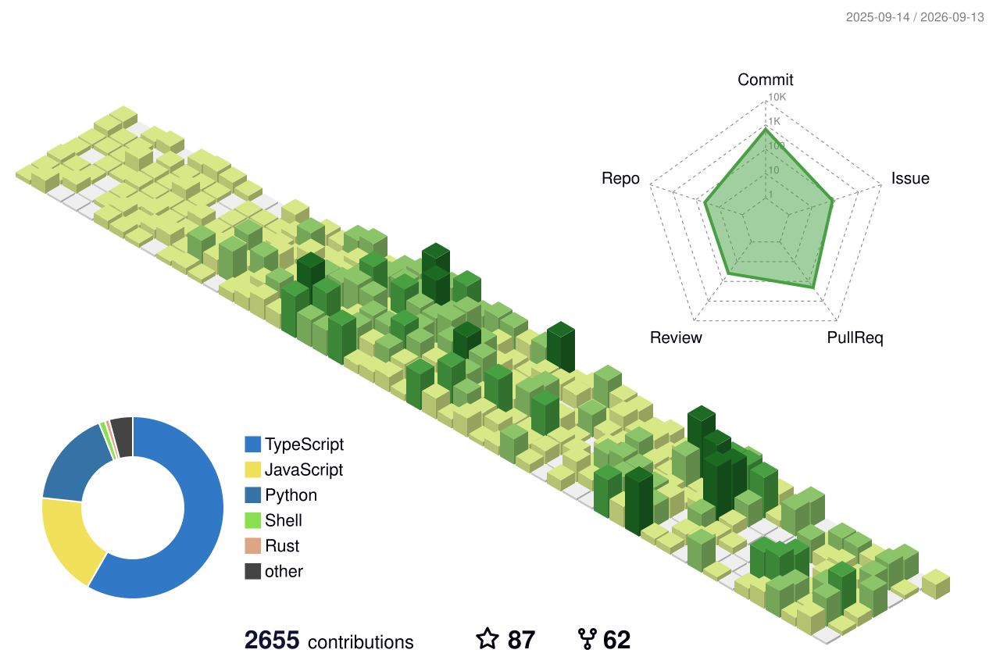

## AppSec & Software Developer

 

&nbsp;&nbsp;
&nbsp;&nbsp;

 

### Projects

| Project | Description |
|:--------|:------------|
| [**OopsSec Store**](https://github.com/kOaDT/oss-oopssec-store) | Deliberately vulnerable e-commerce for security training and CTF. Run `npx create-oss-store`, open your browser, and start hunting flags! |
| [**Cyber Hub**](https://cyberhub.blog/) | Threat intelligence platform: RSS aggregation, NVD CVE tracking, ENISA EUVD, databreaches, ... |
| [**Hash Cracker**](https://github.com/kOaDT/crack-hash) | Multi-threaded dictionary attack tool built with Rust |
| [**Hate Crimes Map**](https://github.com/kOaDT/hate-crimes-map) | Data visualization platform mapping hate crime statistics |

 

### CVE Proof of Concepts

| CVE | Severity | Description |
|:-------|:--------:|:------------|
| [CVE-2025-55182](https://github.com/kOaDT/poc-cve-2025-55182) |  | A pre-authentication remote code execution vulnerability also known as React2Shell |
| [CVE-2025-29927](https://github.com/kOaDT/poc-cve-2025-29927) |  | A vulnerability in Next.js that allows attackers to bypass authorization checks implemented in middleware |

 

<b>Metrics</b>

 

</img>

